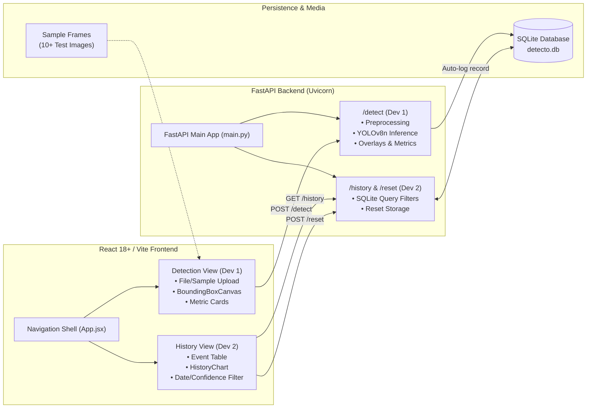
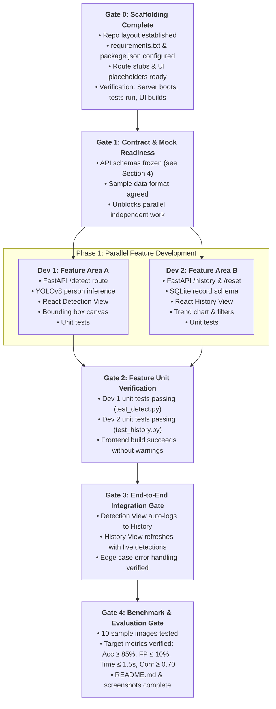

# Detecto 2-Developer Coordination: Overview & Architecture

## 1. Project Context & Objectives

- **Repository**: [`detecto`](https://learn.zone01kisumu.ke/git/akihara/detecto)
- **Goal**: Build a high-performance, real-time person detection and crowd analysis system featuring a FastAPI backend, Ultralytics YOLOv8 computer vision engine, SQLite persistence, and a modern React/Vite dashboard.
- **Team**: 2 Developers collaborating across full-stack feature domains.
- **Key Strategy**: Feature-based split (each developer owns backend endpoint, frontend UI view, and test suite for their feature area) synchronized via strict **Coordination Gates**.

---

## 2. System Architecture & Data Flow



---

## 3. Coordination Gates & Dependency Matrix



### Detailed Gate Specifications

| Gate | Name | Prerequisites / Inputs | Outputs / Unblocked Next Steps |
|---|---|---|---|
| **Gate 0** | **Scaffolding** | Repository initialized, `.gitignore` active | Dependency files, folder structure, passing build & boot checks. Unblocks Phase 0 verification. |
| **Gate 1** | **Contract Freeze** | Gate 0 passed; API schemas frozen in plan | Both Dev 1 and Dev 2 can implement backend and frontend features concurrently using mock data. |
| **Gate 2** | **Unit Verification** | Dev 1 and Dev 2 feature code complete | Unit tests pass (`pytest backend/tests`), UI compiles cleanly (`npm run build`). Unblocks Phase 2 Integration. |
| **Gate 3** | **E2E Integration** | Gate 2 passed; routes wired together | End-to-end user flow: uploading frame triggers detection and populates history. Unblocks Phase 3 Benchmarking. |
| **Gate 4** | **Benchmark & Delivery**| Gate 3 passed; 10 sample images curated | All 5 project metrics met, README documentation complete, screenshots captured. Ready for release. |

---

## 4. Frozen API Contract

### 4.1 `POST /detect`
- **Purpose**: Accept image frame, run YOLOv8 person detection, return count, bounding boxes, confidence, latency, and annotated image preview.
- **Request Formats**:
  1. `multipart/form-data`: `file: UploadFile` (JPEG/PNG)
  2. `application/json`: `{ "image": "<base64_encoded_image>" }`
- **Response Format (JSON)**:
  ```json
  {
    "count": 3,
    "inference_time_ms": 125.4,
    "avg_confidence": 0.88,
    "detections": [
      {
        "box": [0.12, 0.35, 0.85, 0.62],
        "confidence": 0.92,
        "label": "person"
      }
    ],
    "annotated_image": "data:image/jpeg;base64,..."
  }
  ```
  *Coordinate Normalization*: `box` values are normalized `[ymin, xmin, ymax, xmax]` in range `[0.0, 1.0]`.

### 4.2 `GET /history`
- **Purpose**: Retrieve historical detection events with optional filtering.
- **Query Parameters**:
  - `limit`: int (default: 50)
  - `min_confidence`: float (optional, e.g. `0.70`)
  - `start_date`: ISO 8601 string (optional)
  - `end_date`: ISO 8601 string (optional)
- **Response Format (JSON)**:
  ```json
  [
    {
      "id": 1,
      "timestamp": "2026-10-01T15:00:00Z",
      "people_count": 3,
      "avg_confidence": 0.88,
      "inference_time_ms": 125.4,
      "image_name": "frame1.jpg"
    }
  ]
  ```

### 4.3 `POST /reset`
- **Purpose**: Clear detection records from SQLite database.
- **Response Format (JSON)**:
  ```json
  {
    "status": "success",
    "message": "Detection history cleared successfully"
  }
  ```

---

## 5. Consolidated Progress Dashboard

| Phase | Description | Owner | Status | Gate Link | Phase Doc |
|---|---|---|---|---|---|
| **Phase 0** | Project Scaffolding & Dependency Config | Joint | `[x]` Completed | Gate 0 (Passed) | [`phase-0-scaffolding.md`](file:///home/akihara/zone01/detecto/plans/2026-10-01-detecto-coordination/phase-0-scaffolding.md) |
| **Phase 1A**| Detection & Inference Pipeline | Dev 1 | `[ ]` Pending | Gate 1 & 2 | [`phase-1-dev1-detection.md`](file:///home/akihara/zone01/detecto/plans/2026-10-01-detecto-coordination/phase-1-dev1-detection.md) |
| **Phase 1B**| History, Analytics & Persistence | Dev 2 | `[ ]` Pending | Gate 1 & 2 | [`phase-1-dev2-history.md`](file:///home/akihara/zone01/detecto/plans/2026-10-01-detecto-coordination/phase-1-dev2-history.md) |
| **Phase 2** | End-to-End Integration & Edge Cases | Joint | `[ ]` Pending | Gate 3 | [`phase-2-integration.md`](file:///home/akihara/zone01/detecto/plans/2026-10-01-detecto-coordination/phase-2-integration.md) |
| **Phase 3** | 10-Image Benchmarking & Documentation | Joint | `[ ]` Pending | Gate 4 | [`phase-3-benchmarking.md`](file:///home/akihara/zone01/detecto/plans/2026-10-01-detecto-coordination/phase-3-benchmarking.md) |

---

## 6. Living Plan Evolution, Deviations & Bug Tracker

| Date | Type | Description | Status | Resolution / Action |
|---|---|---|---|---|
| 2026-10-01 | Architecture | Shifted from vertical slice to full-stack feature split (Dev 1 Detection, Dev 2 History). | Resolved | Allows both devs broad stack experience without merge collisions. |
| 2026-10-01 | Protocol | Codified commit-on-instruction and push-after-review protocol into AGENTS.md. | Resolved | Prevents unreviewed pushes and massive commits. |
| 2026-10-01 | Documentation | Added root `plans/README.md` and multi-file gate coordination structure. | Resolved | Multi-developer & multi-tool alignment established. |
